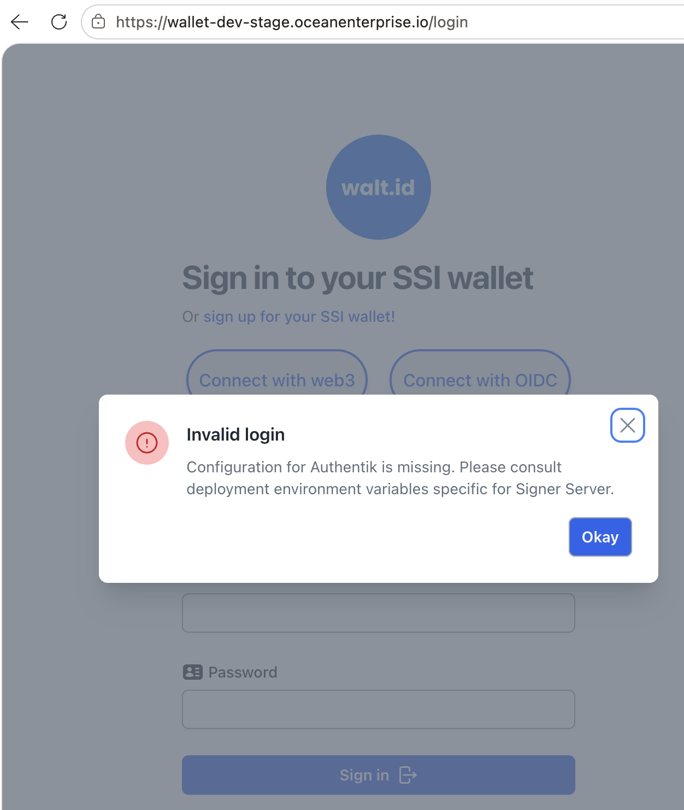

<div align="center">
 <h1>Web Wallet (Frontend)</h1>
 <span>by </span><a href="https://walt.id">walt.id</a>
 <p>Custodian white-label web-wallet solution for Verifiable Credentials and NFTs<p>

<a href="https://walt.id/community">

</a>
<a href="https://twitter.com/intent/follow?screen_name=walt_id">

</a>


</div>

## Getting Started

- [Intro Video](https://youtu.be/HW9CNFmRFlI) - Learn about features and see a demo.


### Running the project using Docker

#### Environment Configuration for Signer Server - Dev Wallet Interface
DEV Wallet Interface supports Signer Server connection.

Before running container with dev walt.id interface, `.env` file, located in root-folder, next to `Dockerfile`, should be created and populated with following variables for connecting with Signer Server:

- **AUTHENTIK_TOKEN_URL** - retrieved from Participant Authentik OIDC provider Token URL;
- **NUXT_PUBLIC_CLIENT_ID** - retrieved from Participant Authentik OIDC provider Client ID;
- **CLIENT_SECRET** - retrieved from Participant Authentik OIDC provider Client Secret;
- **NUXT_PUBLIC_AUTHENTIK_ISSUER** - retrieved from Participant Authentik OIDC provider Issuer;
- **NUXT_PUBLIC_REDIRECT_URI** - which is walt.id hostname with endpoint /auth/callback. Make sure to register in Authentik as Allowed Origins or Redirect URIs the same value;
- **NUXT_PUBLIC_LOGOUT_REDIRECT_URI** - which is walt.id hostname;
- **WALLET_API_INTERNAL_URL**=http://caddy:7001/wallet-api

Variables which do __not__ have prefix `NUXT_PUBLIC_*` are used on server-side rendering to not exposed in the Browser.

##### Troubleshooting Signer Server Configuration
Signer Server authentication uses Authentik emitted JWT.

If **NUXT_PUBLIC_CLIENT_ID**,  **NUXT_PUBLIC_AUTHENTIK_ISSUER**, **NUXT_PUBLIC_REDIRECT_URI** are missing, Browser console skips initializing Authentik plugin and therefore, connection with Signer Server will not be performed when clicking `Connect to Signer Server` button.



#### Container Building & Running

From the root-folder you can run the wallet-api including the necessary configuration as well as other relevant services and apps like the wallet frontend by the following command:
```bash
cd docker-compose && docker compose up
```

- Visit the demo web wallet hosted under [localhost:7101](http://localhost:7101).
- Visit the dev web wallet hosted under [localhost:7104](http://localhost:7104).
- Visit the wallet-api hosted under /swagger endpoint.

Update the containers by running the following commands from the root folder: 
```bash
docker build -f waltid-applications/waltid-web-wallet/apps/waltid-demo-wallet/Dockerfile -t waltid/waltid-demo-wallet .
docker build -f waltid-applications/waltid-web-wallet/apps/waltid-dev-wallet/Dockerfile -t waltid/waltid-dev-wallet .
```
Note that this is project only the frontend of the web-wallet. The corresponding backend is in the /waltid-wallet-api folder.

### Running the project for development

```bash
npm install
cd apps/waltid-demo-wallet && npm run dev
```

## What is the Web-Wallet?

A **white-label solution** built on top of our core libs, offering you everything to build identity POCs leveraging Verifiable Credentials and NFTs/Tokens across ecosystems.

### Features

Features are provided by our libraries SSI-Kit and NFT-Kit to enable SSI and NFT functionality

### SSI

- **Manage VCs** - Receive, Store and Present Verifiable Credentials with different formats (e.g. W3C) and proof-types (e.g. JWT, SD-JWT). Full overview of formats and proof-types [here](https://walt-id.notion.site/Features-by-Product-aab646e46a744a7d84a6b8fd6b7066ac?pvs=4).
- **Manage DIDs** - Create and delete DIDs and onboard to different ecosystems (e.g. did:key, did:jwt, did:ebsi, did:cheqd, did:web and more) Full list [here](https://walt-id.notion.site/Features-by-Product-aab646e46a744a7d84a6b8fd6b7066ac?pvs=4).
- **Manage Keys** - Create, import and export keys with different algorithms (e.g. Ed25519). Full list [here](https://walt-id.notion.site/Features-by-Product-aab646e46a744a7d84a6b8fd6b7066ac?pvs=4).
  
- **Credential Exchange** - Based on OIDC standards (OIDC4VC & OIDC4VP) using synchronous flows with same device and cross device support as well as asynchronous flows leveraging the browser notification system.

### NFTs

- **View NFTs** - Display NFTs from different ecosystems (e.g. Ethereum, Near, Flow and more) in one coherent interface.


## Join the community

* Connect and get the latest updates: [Discord](https://discord.gg/AW8AgqJthZ) | [Newsletter](https://walt.id/newsletter) | [YouTube](https://www.youtube.com/channel/UCXfOzrv3PIvmur_CmwwmdLA) | [Twitter](https://mobile.twitter.com/walt_id)
* Get help, request features and report bugs: [GitHub Issues ](https://github.com/walt-id/waltid-identity/issues)

## License

**Licensed under the [Apache License, Version 2.0](https://github.com/walt-id/waltid-ssikit/blob/master/LICENSE).**
